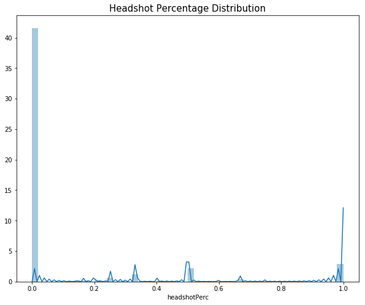

# What is PlayerUnknown's BattleGrounds (PUBG) ?

### - A battle to the <font color=red>last player standing</font>, with 100 players on an island 
### - Start with nothing and have to scavenge and collect weapons and medical supplies
### - Three modes of play: Solo, Duo and Squad


# Sounds Interesting, BUT... a lot of Cheaters!

### - Exploit game bugs to  <font color=red>have way-above-average performance</font> over other players
- Collect 100 weapons without moving
- Kill 100 people
- Revive 100 times
- Run 100m/second

### - Disrupt game balance: The true skilled cannot win!
### - A huge problem since the release of PUBG
- PUBG has banned **13 Million** cheaters!
- **120 people** has been arrested due to developing cheating plugins
- Fines are over **$5.1 Million**

# So...Let's hunt cheaters down!


```python
import pandas as pd
import numpy as np
import matplotlib.pyplot as plt
import seaborn as sns
from sklearn import preprocessing
from lightgbm import LGBMRegressor
from sklearn.svm import OneClassSVM
from sklearn.ensemble import IsolationForest
from sklearn.decomposition import PCA
from sklearn.cluster import KMeans
import plotly
import plotly.plotly as py
import plotly.graph_objs as go
import random
import warnings
warnings.filterwarnings("ignore")
```

    /Users/alexhuo/anaconda3/lib/python3.6/site-packages/lightgbm/__init__.py:46: UserWarning: Starting from version 2.2.1, the library file in distribution wheels for macOS is built by the Apple Clang (Xcode_9.4.1) compiler.
    This means that in case of installing LightGBM from PyPI via the ``pip install lightgbm`` command, you don't need to install the gcc compiler anymore.
    Instead of that, you need to install the OpenMP library, which is required for running LightGBM on the system with the Apple Clang compiler.
    You can install the OpenMP library by the following command: ``brew install libomp``.
      "You can install the OpenMP library by the following command: ``brew install libomp``.", UserWarning)
    /Users/alexhuo/anaconda3/lib/python3.6/site-packages/sklearn/ensemble/weight_boosting.py:29: DeprecationWarning: numpy.core.umath_tests is an internal NumPy module and should not be imported. It will be removed in a future NumPy release.
      from numpy.core.umath_tests import inner1d


```python
#link of data
#https://www.kaggle.com/c/pubg-finish-placement-prediction/data
train = pd.read_csv('./data/train_V2.csv')
```


```python
pd.options.display.max_columns = None
train.head()
```


<div>
<style scoped>
    .dataframe tbody tr th:only-of-type {
        vertical-align: middle;
    }

    .dataframe tbody tr th {
        vertical-align: top;
    }

    .dataframe thead th {
        text-align: right;
    }
</style>
<table border="1" class="dataframe">
  <thead>
    <tr style="text-align: right;">
      <th></th>
      <th>Id</th>
      <th>groupId</th>
      <th>matchId</th>
      <th>assists</th>
      <th>boosts</th>
      <th>damageDealt</th>
      <th>DBNOs</th>
      <th>headshotKills</th>
      <th>heals</th>
      <th>killPlace</th>
      <th>killPoints</th>
      <th>kills</th>
      <th>killStreaks</th>
      <th>longestKill</th>
      <th>matchDuration</th>
      <th>matchType</th>
      <th>maxPlace</th>
      <th>numGroups</th>
      <th>rankPoints</th>
      <th>revives</th>
      <th>rideDistance</th>
      <th>roadKills</th>
      <th>swimDistance</th>
      <th>teamKills</th>
      <th>vehicleDestroys</th>
      <th>walkDistance</th>
      <th>weaponsAcquired</th>
      <th>winPoints</th>
      <th>winPlacePerc</th>
    </tr>
  </thead>
  <tbody>
    <tr>
      <th>0</th>
      <td>7f96b2f878858a</td>
      <td>4d4b580de459be</td>
      <td>a10357fd1a4a91</td>
      <td>0</td>
      <td>0</td>
      <td>0.00</td>
      <td>0</td>
      <td>0</td>
      <td>0</td>
      <td>60</td>
      <td>1241</td>
      <td>0</td>
      <td>0</td>
      <td>0.00</td>
      <td>1306</td>
      <td>squad-fpp</td>
      <td>28</td>
      <td>26</td>
      <td>-1</td>
      <td>0</td>
      <td>0.0000</td>
      <td>0</td>
      <td>0.00</td>
      <td>0</td>
      <td>0</td>
      <td>244.80</td>
      <td>1</td>
      <td>1466</td>
      <td>0.4444</td>
    </tr>
    <tr>
      <th>1</th>
      <td>eef90569b9d03c</td>
      <td>684d5656442f9e</td>
      <td>aeb375fc57110c</td>
      <td>0</td>
      <td>0</td>
      <td>91.47</td>
      <td>0</td>
      <td>0</td>
      <td>0</td>
      <td>57</td>
      <td>0</td>
      <td>0</td>
      <td>0</td>
      <td>0.00</td>
      <td>1777</td>
      <td>squad-fpp</td>
      <td>26</td>
      <td>25</td>
      <td>1484</td>
      <td>0</td>
      <td>0.0045</td>
      <td>0</td>
      <td>11.04</td>
      <td>0</td>
      <td>0</td>
      <td>1434.00</td>
      <td>5</td>
      <td>0</td>
      <td>0.6400</td>
    </tr>
    <tr>
      <th>2</th>
      <td>1eaf90ac73de72</td>
      <td>6a4a42c3245a74</td>
      <td>110163d8bb94ae</td>
      <td>1</td>
      <td>0</td>
      <td>68.00</td>
      <td>0</td>
      <td>0</td>
      <td>0</td>
      <td>47</td>
      <td>0</td>
      <td>0</td>
      <td>0</td>
      <td>0.00</td>
      <td>1318</td>
      <td>duo</td>
      <td>50</td>
      <td>47</td>
      <td>1491</td>
      <td>0</td>
      <td>0.0000</td>
      <td>0</td>
      <td>0.00</td>
      <td>0</td>
      <td>0</td>
      <td>161.80</td>
      <td>2</td>
      <td>0</td>
      <td>0.7755</td>
    </tr>
    <tr>
      <th>3</th>
      <td>4616d365dd2853</td>
      <td>a930a9c79cd721</td>
      <td>f1f1f4ef412d7e</td>
      <td>0</td>
      <td>0</td>
      <td>32.90</td>
      <td>0</td>
      <td>0</td>
      <td>0</td>
      <td>75</td>
      <td>0</td>
      <td>0</td>
      <td>0</td>
      <td>0.00</td>
      <td>1436</td>
      <td>squad-fpp</td>
      <td>31</td>
      <td>30</td>
      <td>1408</td>
      <td>0</td>
      <td>0.0000</td>
      <td>0</td>
      <td>0.00</td>
      <td>0</td>
      <td>0</td>
      <td>202.70</td>
      <td>3</td>
      <td>0</td>
      <td>0.1667</td>
    </tr>
    <tr>
      <th>4</th>
      <td>315c96c26c9aac</td>
      <td>de04010b3458dd</td>
      <td>6dc8ff871e21e6</td>
      <td>0</td>
      <td>0</td>
      <td>100.00</td>
      <td>0</td>
      <td>0</td>
      <td>0</td>
      <td>45</td>
      <td>0</td>
      <td>1</td>
      <td>1</td>
      <td>58.53</td>
      <td>1424</td>
      <td>solo-fpp</td>
      <td>97</td>
      <td>95</td>
      <td>1560</td>
      <td>0</td>
      <td>0.0000</td>
      <td>0</td>
      <td>0.00</td>
      <td>0</td>
      <td>0</td>
      <td>49.75</td>
      <td>2</td>
      <td>0</td>
      <td>0.1875</td>
    </tr>
  </tbody>
</table>
</div>


```python
train.info()
```

    <class 'pandas.core.frame.DataFrame'>
    RangeIndex: 4446966 entries, 0 to 4446965
    Data columns (total 29 columns):
    Id                 object
    groupId            object
    matchId            object
    assists            int64
    boosts             int64
    damageDealt        float64
    DBNOs              int64
    headshotKills      int64
    heals              int64
    killPlace          int64
    killPoints         int64
    kills              int64
    killStreaks        int64
    longestKill        float64
    matchDuration      int64
    matchType          object
    maxPlace           int64
    numGroups          int64
    rankPoints         int64
    revives            int64
    rideDistance       float64
    roadKills          int64
    swimDistance       float64
    teamKills          int64
    vehicleDestroys    int64
    walkDistance       float64
    weaponsAcquired    int64
    winPoints          int64
    winPlacePerc       float64
    dtypes: float64(6), int64(19), object(4)
    memory usage: 983.9+ MB


```python
#Utility functions
def train_test_split(df, test_size=0.3):
    import random
    match_ids = df['matchId'].unique().tolist()
    train_size = int(len(match_ids) * (1 - test_size))
    train_match_ids = random.sample(match_ids, train_size)

    train = df[df['matchId'].isin(train_match_ids)]
    test = df[-df['matchId'].isin(train_match_ids)]
    return train, test

def outlier_range(var,perc,df):
    return np.percentile(df[var],perc)

def show_distplot(var,title):
    plt.figure(figsize=(10,8))
    sns.distplot(df[var],bins=50)
    plt.title(title,fontsize=15)
    plt.show()
```


```python
#data cleaning and feature engineering part
df = train[(train['matchType'].isin(['solo','solo-fpp','duo','duo-fpp','squad','squad-fpp']))]

#number of player each match/each team
df['numJoined'] = df.groupby('matchId')['matchId'].transform('count')
df['teamNum'] = df.groupby('groupId')['groupId'].transform('count')

df['totalDistance'] = df['rideDistance'] + df['swimDistance'] + df['walkDistance']
df['headshotPerc'] = df['headshotKills']/df['kills']

#since each game has different num of players, needs to normalize
normalize = (100-df['numJoined'])/100 + 1
df['killsNorm'] = df['kills'] * normalize

df['killsPerDistance'] = df['killsNorm']/(df['totalDistance'] + 1e31)
df['weaponPerDistance'] = df['weaponsAcquired']/(df['totalDistance'] + 1e31)

#explore heals and boost
#allow you to stay out of zone longer
df['healsAndBoosts'] = df['heals'] + df['boosts']
df['healsAndBoostsPerWalkDistance'] = df['healsAndBoosts']/(df['walkDistance']+1e31)
df['healsAndBoostsPerKill'] = df['healsAndBoosts']/(df['killsNorm']+1e31)

#deal with inf and nan
df.replace([np.inf, -np.inf], np.nan)
df.fillna(0,inplace=True)
```


```python
#feature importance using light GBM
target = 'winPlacePerc'
cols_to_drop = ['Id', 'groupId', 'matchId', 'matchType', target, 'killPlace','walkDistance','numJoined','teamNum',
               'matchDuration','kills','maxPlace','winPoints','boosts','heals','rideDistance','swimDistance',
               'rankPoints','revives','teamKills','numGroups','totalDistance']
cols_to_fit = [col for col in df.columns if col not in cols_to_drop]
train, val = train_test_split(df, 0.3)

params = {
    'n_estimators': 100,
    'learning_rate': 0.3, 
    'num_leaves': 20,
    'objective': 'regression_l2', 
    'metric': 'mae',
    'verbose': -1,
}

model = LGBMRegressor(**params)
model.fit(
    train[cols_to_fit], train[target],
    eval_set=[(val[cols_to_fit], val[target])],
    eval_metric='mae',
    verbose=-1,
)

feature_importance = pd.DataFrame(sorted(zip(model.feature_importances_, cols_to_fit)), columns=['Value','Feature'])

plt.figure(figsize=(12, 8))
sns.barplot(x="Value", y="Feature", data=feature_importance.sort_values(by="Value", ascending=False))
plt.title('Feature Importance with LightGBM')
plt.tight_layout()
```


# What are some important features to assess cheaters?

### - Normalized Kills (according to number of players joined the match)
### - Headshot Percentage
### - RoadKills
### - Weapons acquired per distance
### - Medical supplies per kill

# How is everyone doing in PUBG?

## <font color=darkcyan>Kills -- Massacre?</font>


```python
random.seed(831)

plotly.tools.set_credentials_file(username='jhuo831alex', api_key='3vxmhQ7fVjmu9GyOFEqo')
data,test = train_test_split(df,0.99)
data = data[['killsNorm','winPlacePerc']]
data['killsNorm'] = data['killsNorm'].astype('int')
N = 30
c = ['hsl('+str(h)+',50%'+',50%)' for h in np.linspace(0, 360, N)]
kill_num = list(set(data['killsNorm']))
graph_data = [{
    'y': data['winPlacePerc'].loc[data['killsNorm']==kill_num[i]],
    'name':kill_num[i],
    'type':'box',
    'marker':{'color': c[i]}
} for i in range(len(kill_num))]

layout = {'xaxis': {'showgrid':True,'zeroline':False, 'tickangle':60,'showticklabels':True,'title':'Number of Kills'},
          'yaxis': {'zeroline':False,'gridcolor':'white','title':'Rank Percentile'},
          #'paper_bgcolor': 'rgb(233,233,233)',
          #'plot_bgcolor': 'rgb(233,233,233)',
          'title': 'Kills vs. Final Rank Percentile'
          }
fig = go.Figure(data=graph_data,layout=layout)
py.iplot(fig)
```


<iframe id="igraph" scrolling="no" style="border:none;" seamless="seamless" src="https://plot.ly/~jhuo831alex/102.embed" height="525px" width="100%"></iframe>


```python
non_killing_perc = round(len(df[df['killsNorm']==0])/len(df) * 100,2)
two_killing_perc = round(len(df[df['killsNorm']<=2])/len(df) * 100,2)
max_kill = int(max(df['killsNorm']))
outlier_kill = outlier_range('killsNorm',99,df)

# print(non_killing_perc)
# print(two_killing_perc)
# print(max_kill)
# print(outlier_kill)
```

### 56.98% of players did not kill a single enemy!
### 78.22% of players killed less than 3 enemies.
### But...One player killed <font color=red>34</font> people in a game?! Sounds suspicious ummmm...
### So if one player killed more than 99% of other players do, we assume this individual could be possibly cheating.

## <font color=darkcyan>Incredible Head Shooters?</font>


```python
show_distplot('headshotPerc','Headshot Percentage Distribution')
```





```python
max_headshot = df['kills'][df['headshotPerc']==1].max()
#print(max_headshot)
```

### Has 100% headshot rate shows you are a good player.
### Yet...killing 15 people all by headshots? Too good to be true! Could be cheaters.

##  <font color=darkcyan>Experienced Drivers or Cheaters?</font>


```python
df[['Id','roadKills','kills','winPlacePerc']].sort_values('roadKills').tail(3)
```


<div>
<style scoped>
    .dataframe tbody tr th:only-of-type {
        vertical-align: middle;
    }

    .dataframe tbody tr th {
        vertical-align: top;
    }

    .dataframe thead th {
        text-align: right;
    }
</style>
<table border="1" class="dataframe">
  <thead>
    <tr style="text-align: right;">
      <th></th>
      <th>Id</th>
      <th>roadKills</th>
      <th>kills</th>
      <th>winPlacePerc</th>
    </tr>
  </thead>
  <tbody>
    <tr>
      <th>2767999</th>
      <td>34193085975338</td>
      <td>11</td>
      <td>11</td>
      <td>0.4713</td>
    </tr>
    <tr>
      <th>2733926</th>
      <td>c3e444f7d1289f</td>
      <td>14</td>
      <td>14</td>
      <td>0.4286</td>
    </tr>
    <tr>
      <th>2890740</th>
      <td>a3438934e3e535</td>
      <td>18</td>
      <td>20</td>
      <td>1.0000</td>
    </tr>
  </tbody>
</table>
</div>


```python
has_roadkill = round(100 - len(df[df['roadKills']==0])/len(df) * 100,2)
max_roadkill = int(max(df['roadKills']))
```

### Only 0.26% of players had crashed over enemies using vehicles.
### One player ran over <font color=red>18</font> enemies with his/her car!! This is insane!!
### Once again, if one player kills absurdly many enemies by car, we assume this individual could be a cheater. 

##  <font color=darkcyan>Weapon Magnets?</font>


```python
hover_text,bubble_size = [], []
data,test = train_test_split(df,0.9999)
data['is_team'] = np.where(data['matchType'].isin(['solo','solo-fpp']),'solo',
                         np.where(data['matchType'].isin(['duo','duo-fpp']),'duo','squad'))
for index, row in data.iterrows():
    hover_text.append(('Match Type: {is_team}<br>'+
                      'Rank Percentile: {winPlacePerc}<br>'+
                      'Total Distance Traveled: {totalDistance}<br>'+
                      'Weapons Acquired: {weaponsAcquired}<br>').format(is_team=row['is_team'],
                                            winPlacePerc=row['winPlacePerc'],
                                            totalDistance=row['totalDistance'],
                                            weaponsAcquired=row['weaponsAcquired']))
    bubble_size.append(row['weaponsAcquired'] * 500)
data['text'] = hover_text
data['size'] = bubble_size
sizeref = data['weaponsAcquired'].max()

match_types = list(set(data['is_team']))
graph_data = list()

for match_type in match_types:
    trace = go.Scatter(
                x=data['totalDistance'][data['is_team'] == match_type],
                y=data['winPlacePerc'][data['is_team'] == match_type ],
                mode='markers',
                name=match_type,
                text=data['text'][data['is_team'] == match_type],
                marker=dict(
                    symbol='circle',
                    sizemode='area',
                    sizeref=sizeref,
                    size=data['size'][data['is_team'] == match_type],
                    line=dict(
                        width=2
                    ),
                )
            )
    graph_data.append(trace)

layout = go.Layout(
    title='Rank Percentile based on Weapons acquired per Distance',
    xaxis=dict(
        title='Total Distance Traveled',
        gridcolor='rgb(255, 255, 255)',
        range=[0, max(data['totalDistance'])],
        zerolinewidth=1,
        ticklen=5,
        gridwidth=2,
    ),
    yaxis=dict(
        title='Rank Percentile',
        gridcolor='rgb(255, 255, 255)',
        range=[0, 1.05],
        zerolinewidth=1,
        ticklen=5,
        gridwidth=2,
    ),
)

fig = go.Figure(data=graph_data, layout=layout)
py.iplot(fig)
```


<iframe id="igraph" scrolling="no" style="border:none;" seamless="seamless" src="https://plot.ly/~jhuo831alex/104.embed" height="525px" width="100%"></iframe>


```python
outlier_weapon = round(len(df[(df['weaponsAcquired'] > 10) & (df['totalDistance'] == 0)])/len(df) * 100,2)
max_weapon = df[df['totalDistance']==0]['weaponsAcquired'].max()

# print(outlier_weapon)
# print(max_weapon)
```

### Typically, you wander around to gather weapons.
### Yet, 0.01% of players collect more than 10 weapons without moving. Interesting...
### One player acquired <font color=red>52</font> weapons without moving a single meter!
### We assume this kind of "Weapon Magnets" to be cheaters.

## <font color=darkcyan>Deadpools?</font>


```python
hover_text = []
data,test = train_test_split(df,0.99)
for index, row in data.iterrows():
    hover_text.append(('Number of Kills: {killsNorm}<br>'+
                      'Heals and Boosts: {healsAndBoosts}<br>'+
                      'Rank Percentile: {winPlacePerc}<br>').format(killsNorm=row['killsNorm'],
                                            healsAndBoosts=row['healsAndBoosts'],
                                            winPlacePerc=row['winPlacePerc']))
data['text'] = hover_text
trace1 = go.Scatter3d(
    x=data['killsNorm'],
    y=data['healsAndBoosts'],
    z=data['winPlacePerc'],
    mode='markers',
    text = data['text'],
    marker=dict(
        size=5,
        color = 'pink',
        line = dict(color='lightblue', width = 0.5),
        colorscale='Jet', 
        opacity=0.8
    )
)
graph_data = [trace1]
layout = go.Layout(
    title='Number of Kills v. Medical Supplies v. Rank Percentile',
    autosize=False,
    scene=go.Scene(
        xaxis=go.XAxis(title='Number of Kills'),
        yaxis=go.YAxis(title='Heals and Boosts'),
        zaxis=go.ZAxis(title='Rank Percentile')),
     margin=dict(
        l=65,
        r=50,
        b=65,
        t=90
    )
)

fig = go.Figure(data=graph_data, layout=layout)
py.iplot(fig)
```


<iframe id="igraph" scrolling="no" style="border:none;" seamless="seamless" src="https://plot.ly/~jhuo831alex/106.embed" height="525px" width="100%"></iframe>


### Not using medical supplies is normal, 
### But...Killing over <font color=red>10</font> people without healing, are they deadpools or cheaters??


```python
df[['healsAndBoosts','kills','winPlacePerc']][df['healsAndBoosts']==0].sort_values('kills').tail(3)
```


<div>
<style scoped>
    .dataframe tbody tr th:only-of-type {
        vertical-align: middle;
    }

    .dataframe tbody tr th {
        vertical-align: top;
    }

    .dataframe thead th {
        text-align: right;
    }
</style>
<table border="1" class="dataframe">
  <thead>
    <tr style="text-align: right;">
      <th></th>
      <th>healsAndBoosts</th>
      <th>kills</th>
      <th>winPlacePerc</th>
    </tr>
  </thead>
  <tbody>
    <tr>
      <th>652889</th>
      <td>0</td>
      <td>16</td>
      <td>1.0</td>
    </tr>
    <tr>
      <th>2033134</th>
      <td>0</td>
      <td>17</td>
      <td>1.0</td>
    </tr>
    <tr>
      <th>3517965</th>
      <td>0</td>
      <td>17</td>
      <td>1.0</td>
    </tr>
  </tbody>
</table>
</div>


```python
#subset the data from 4 million to 0.1 million to save computation time
#use the above assumptions to find out the cheaters in this 0.1 million data
data_sub,try_ = train_test_split(df,0.977)

id_set = set()
id_set.update(data_sub['Id'].loc[data_sub['killsNorm'] >= np.percentile(data_sub['killsNorm'],99)])
id_set.update(data_sub[data_sub['roadKills']>=int(outlier_range('roadKills',99.9,data_sub))]['Id'])
id_set.update(data_sub[(data_sub['weaponsAcquired'] > outlier_range('weaponsAcquired',99,data_sub)) & (data_sub['totalDistance'] == 0)]['Id'])
id_set.update(data_sub[(data_sub['headshotPerc']==1)&(data_sub['killsNorm']>outlier_range('killsNorm',99,data_sub))]['Id'])
id_set.update(data_sub[(data_sub['healsAndBoosts']==0)&(data_sub['killsNorm'] > outlier_range('killsNorm',99,data_sub))]['Id'])
```


```python
outlier_len = len(set(id_set))
#print(outlier_len)
```

### According to our assumptions above, we found <font color=red>1329</font> potential cheaters out of 0.1 million players.
### Is there any faster way to catch cheaters? Yes! 

# Machine Learning: Anomaly Detection

## <font color=darkcyan>One-Class Support Vector Machine (OCSVM)</font>


```python
#data preparation
data = data_sub[['roadKills','killsNorm','weaponPerDistance','healsAndBoostsPerKill','headshotPerc']]
min_max_scaler = preprocessing.StandardScaler()
np_scaled = min_max_scaler.fit_transform(data)
data = pd.DataFrame(np_scaled)
```

## PCA to speed-up ML algorithms


```python
# PCA to speed-up machine learning algorithms
pca = PCA(n_components=5)
pca_data = pca.fit_transform(data)
print(pca.explained_variance_ratio_) #every component explains a part of data
```

    [0.3855168  0.2003042  0.18627083 0.12983489 0.09807328]


## Decide the proportion of cheaters in games


```python
outlier_lst = [0.01,0.05,0.1]

#find out proportion of cheaters in the games
for outliers_fraction in outlier_lst:
    model =  OneClassSVM(nu=0.95 * outliers_fraction,verbose=False) 
    model.fit(data)
    data_sub['anomaly_svm'] = model.predict(data)
    data_sub['anomaly_svm'] = data_sub['anomaly_svm'].map({1: 0, -1: 1})

    cheater_id = data_sub['Id'].loc[data_sub['anomaly_svm']==1]
    precision = round(len(set(cheater_id) & id_set) / len(id_set) * 100,2)
    
    print(f'Assumption: There are {str(outliers_fraction*100)}% of cheaters in the games:')
    print('Count of cheaters: 0 - Normal players, 1 - Cheaters')
    print(data_sub['anomaly_svm'].value_counts())
    print(f"""{str(precision)}% of the {str(outlier_len)} player we identified as cheaters using above assumptions and data visualization methods 
are also labeled as cheaters using the One-Class SVM model.\n""")
```

    Assumption: There are 1.0% of cheaters in the games:
    Count of cheaters: 0 - Normal players, 1 - Cheaters
    0    95104
    1     6776
    Name: anomaly_svm, dtype: int64
    29.65% of the 1329 player we identified as cheaters using above assumptions and data visualization methods 
    are also labeled as cheaters using the One-Class SVM model.
    
    Assumption: There are 5.0% of cheaters in the games:
    Count of cheaters: 0 - Normal players, 1 - Cheaters
    0    91019
    1    10861
    Name: anomaly_svm, dtype: int64
    77.58% of the 1329 player we identified as cheaters using above assumptions and data visualization methods 
    are also labeled as cheaters using the One-Class SVM model.
    
    Assumption: There are 10.0% of cheaters in the games:
    Count of cheaters: 0 - Normal players, 1 - Cheaters
    0    88087
    1    13793
    Name: anomaly_svm, dtype: int64
    98.87% of the 1329 player we identified as cheaters using above assumptions and data visualization methods 
    are also labeled as cheaters using the One-Class SVM model.
    


## Cross Validating the model:

### When cheater proportion is 10%,  <font color=red>98.87%</font> of the 1329 players we identified as cheaters using above 
### assumptions and data visualization methods are also labeled as cheaters using the One-Class SVM model.
### <font color=orange>10% is a good estimation of proportion of cheaters in PUBG, and the model is actually identifying cheaters.</font>

## Try another method to cross validate... <font color=darkcyan>Isolation Forest</font>


```python
model =  IsolationForest(contamination = outliers_fraction)
model.fit(data)
# add the data to the main  
data_sub['anomaly_if'] = model.predict(data)
data_sub['anomaly_if'] = data_sub['anomaly_if'].map( {1: 0, -1: 1} )
print(data_sub['anomaly_if'].value_counts())
```

    0    91688
    1    10192
    Name: anomaly_if, dtype: int64


```python
cheater_id2 = data_sub['Id'].loc[data_sub['anomaly_if']==1]
precision2 = round(len(set(cheater_id2) & id_set) / len(id_set) * 100,2)
#print(precision2)
```

###  <font color=red>91.27%</font> of the 1329 players we identified as cheaters using above assumptions and data visualization methods 
### are also labeled as cheaters, showing that Isolation Forest is also a good model to identify cheaters.

## Find the players identified by both models as cheaters


```python
overlap_len = len(set(data_sub['Id'].loc[data_sub['anomaly_if']==1]) & set(data_sub['Id'].loc[data_sub['anomaly_svm']==1]))
min_len = min(len(data_sub['Id'].loc[data_sub['anomaly_if']==1]),len(data_sub['Id'].loc[data_sub['anomaly_svm']==1]))
overlap_coeff = round(overlap_len/min_len *100,2)
# print(overlap_len)
# print(overlap_coeff)
```

### 6563 players are labeled as cheaters by both SVM and Isolation Forest model. The overlap coefficient is 64.39%.
### After cross validation, we are now confident that these 6563 players are more likely to be cheaters.

# What we did to catch cheaters...


# Proudly Presented by  <font color=gold>Team ChickenDinner</font>
# Thank you for listening! 
